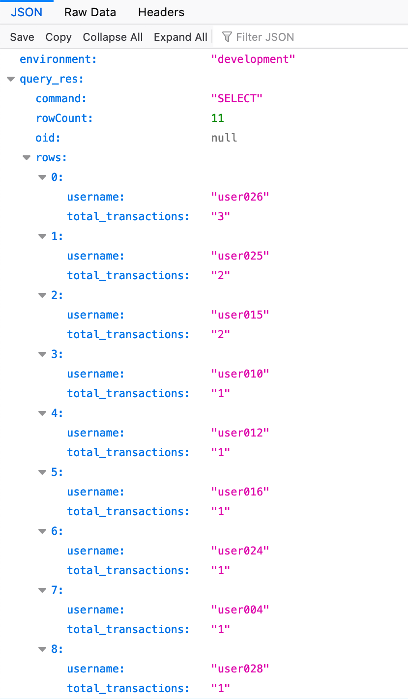

# Docker Compose for Node.js and PostgreSQL

Quick way to use Typescript and Postgres to obtain a user-search ranking

Data are seeded via [scripts/seed_data.py](scripts/seed_data.py)
1. User accounts are randomized
2. Number of transactions are randomized.
3. Transaction amount are randomized.


## Run

    docker-compose up --build

## Test

```sh
curl http://localhost:3000/getclosestusers?user=user001
# {"environment":"development","database":"up"}
```

Result (using Firefox)
Ranking = total_transactions
